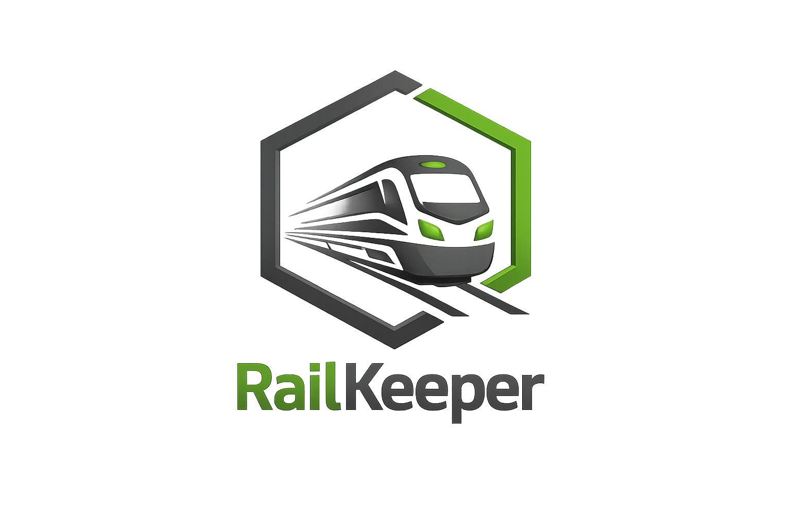

<p align="center">
  
</p>

<h1 align="center">RailKeeper</h1>

<p align="center">
  Self-hosted inventory, documentation and operations cockpit for model railway collections.
</p>

<p align="center">
  <a href="https://github.com/ichwars/RailKeeper2/releases/latest"></a>
  <a href="https://github.com/ichwars/RailKeeper2/actions/workflows/ci.yml"></a>
  
  
  
  
  <a href="LICENSE.md"></a>
  <a href="https://github.com/ichwars/RailKeeper2/releases"></a>
</p>

## Overview

RailKeeper is a complete self-hosted application for managing model railway vehicles, decoder data, images, documents, maintenance, exhibition lists and imports in one local-first workspace. It runs as a single Go service with an integrated React frontend and stores all operational data in SQLite.

The project is designed for private collections, clubs and small workshops that want a serious inventory system without a cloud dependency. RailKeeper keeps data, uploads and backups under your control while still offering modern workflows such as article web search, structured import review, ECoS readout and release update checks.

## Highlights

- Local-first inventory with SQLite, uploads and JSON backups
- Vehicle records with model data, technical fields, images, attachments, QR codes and print views
- Article data web search with configurable sources and explicit field-by-field review
- ECoS live connection for reading locomotive lists and preparing future external ID synchronization
- Decoder function mapping from F0 to F31 with symbol library and stored SVG/PNG graphics
- Structured CV values, CV import/export, decoder profiles and ESU/LokProgrammer file metadata
- Maintenance, condition history and searchable documentation per vehicle
- Exhibition lists with lock state, dedicated Messe role and print-ready list views
- Local authentication with first-run setup, roles, sessions, password change and audit log
- Master data management for manufacturers, gauges, epochs, categories, subtypes, railway companies and symbols
- Docker Compose deployment with hardened runtime container and persistent `/data` volume
- Built-in GitHub release update check with release notes and user-controlled installation flow

## Screens

RailKeeper is built around operational views instead of marketing pages:

- **Overview** for inventory, value, maintenance and data quality
- **Inventory** for vehicle search, editing, uploads, CVs and function keys
- **Exhibition List** for fair/show operations
- **Import/Export** for spreadsheet imports, controlled updates and ECoS readout
- **Settings** for master data, appearance, backups, updates and authentication

## Quick Start

### Docker Compose

```bash
git clone https://github.com/ichwars/RailKeeper2.git
cd RailKeeper2
docker compose pull
docker compose up -d
```

Open:

```text
http://localhost:8080
```

On first start RailKeeper opens the setup screen. Create the first admin account there. No default credentials are shipped.

### Update an existing Docker installation

```bash
git pull
docker compose pull
docker compose up -d
```

The SQLite database, uploads and local files stay in the `railkeeper2_data` Docker volume.

To pin a specific release instead of `latest`, set this in `.env`:

```env
RAILKEEPER_IMAGE=ghcr.io/ichwars/railkeeper2:v0.1.3
```

If you intentionally want to build the checked-out source tree, use:

```bash
docker compose up -d --build
```

### Optional environment file

Copy `.env.example` to `.env` only when you want to override operational settings such as secure cookies, upload limits, printer configuration or the GitHub release endpoint.

Do not override these container paths in Docker Compose:

```env
RAILKEEPER_DATA_DIR=/data
RAILKEEPER_MIGRATIONS_DIR=/app/migrations
RAILKEEPER_SEEDS_DIR=/app/seeds
RAILKEEPER_STATIC_DIR=/app/web
```

## Local Development

Backend:

```bash
cd backend
go test ./...
go run ./cmd/railkeeper
```

Frontend:

```bash
cd frontend
npm ci
npm run build
```

The production runtime serves the built frontend from `frontend/dist`.

Useful local defaults:

```env
RAILKEEPER_ADDR=:8080
RAILKEEPER_DATA_DIR=./data
RAILKEEPER_MIGRATIONS_DIR=./backend/migrations
RAILKEEPER_SEEDS_DIR=./backend/seeds
RAILKEEPER_STATIC_DIR=./frontend/dist
RAILKEEPER_COOKIE_SECURE=false
RAILKEEPER_UPDATE_CHECK_URL=https://api.github.com/repos/ichwars/RailKeeper2/releases/latest
```

## Architecture

```text
backend/
  cmd/railkeeper/          Go entrypoint
  internal/api/            HTTP routes, middleware and response mapping
  internal/application/    use cases, validation, backup and transactions
  internal/infrastructure/ SQLite, migrations and seed loading
  migrations/              SQLite schema migrations
  seeds/                   master data seed JSON
frontend/
  src/app/                 shell, routing and global styles
  src/features/            setup, auth, vehicles, exhibition, import/export, settings
  src/shared/              API adapter, i18n and shared frontend types
openapi/
  railkeeper.yaml          API contract
deploy/
  README.md                deployment notes
docs/
  architecture.md
  roadmap.md
  security.md
```

## Security

RailKeeper is intended for trusted self-hosted environments, but the default installation avoids the common mistakes:

- no default admin account
- Argon2id password hashing
- HTTP-only session cookies
- SameSite cookies and CSRF protection
- role checks for viewer, editor, admin and Messe workflows
- setup, login and session rate limiting
- audit log for relevant security and data actions
- upload size limits and executable attachment blocking
- runtime data ignored by Git

For HTTPS deployments set:

```env
RAILKEEPER_COOKIE_SECURE=true
```

## Counters And Badges

The README includes a GitHub release download badge. GitHub does not provide a reliable public README view counter or generic install counter for self-hosted Docker deployments. Those would require third-party tracking, package registry metrics or explicit opt-in telemetry, none of which is enabled by RailKeeper.

## License

RailKeeper is released under the MIT Self-Hosting License. See [LICENSE.md](LICENSE.md).

## Support

If RailKeeper saves you time, coffee is a perfectly acceptable bug fuel:

<a href="https://www.buymeacoffee.com/drothe20128" target="_blank"></a>
